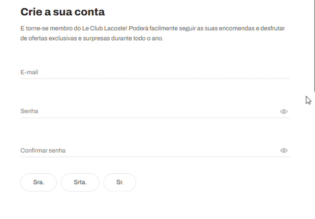

## `1º Site: Lacoste`
Campos identificados no cadastro desse site:

`Primeira etapa : LogIn`

* E-mail
* Senha
* Confirmar senha
* Identificação: Sra, Srta, Sr. 
* Nome, Sobrenome
* CPF
* Nascimento

`Segunda etapa: Endereço de entrega:`

* Nome
* Sobrenome
* CEP
* Telefone
* CPF

## `2º Site: Mari Maria Makeup`
Campos identificados no cadastro desse site:

`Primeira etapa:`

* Cupom de desconto
* CEP para entrega

`Segunda etapa: Finalização da compra`

* E-mail
* Nome
* Sobrenome
* CPF
* Telefone
* CEP

`Terceira etapa: Entrega`

* Rua
* Número
* Complemento e referência, quem irá receber ( nome e sobrenome )

## `3º Site: DC Shoes`
Campos identificados no cadastro desse site:

`Primeira etapa: Cadastro` 

* Nome completo
* CPF
* Data de nascimento
* Telefone de contato fixo e celular
* Sexo
* Email
* Senha e confirmação de senha.

`Segunda etapa: Entrega`

* CEP 
* Número, complemento, referência
* Identificação, nome do destinatário

